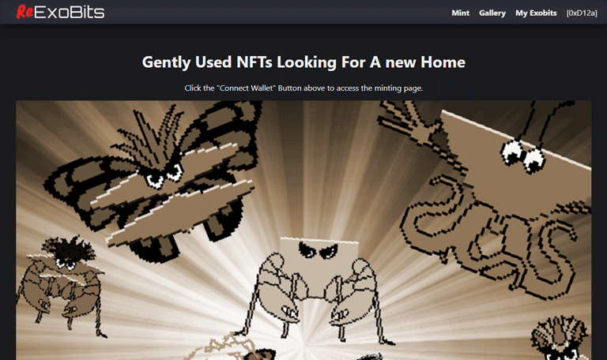

# simple-mint-exobits-nft-clone

> ReExoBits Second Hand NFT Store with Simple Minting

> A complete NFT website with Minting and Gallery features.



## Article

This project accompanies ["How To Build An NFT Website"](https://medium.com/@greenzeta/how-to-build-an-nft-website-b66431560fff) on Medium. The article explains everything you need to get started building an NFT website. Including: Contract deployment and interaction with a live contract using [Web3.js](https://github.com/ChainSafe/web3.js). Though this project stands by itself, it is recommended that you follow the full tutorial for a complete understanding.

## Setup

Clone this repo and enter the project directory:

```sh
$ cd simple-mint-exobits-nft-clone
```

Install dependencies:

```sh
$ npm install
```

## Development

Run the local webpack-dev-server with livereload and autocompile on [http://localhost:3000/](http://localhost:3000/)

```sh
$ npm start
```

## Deployment

Build the current application

```sh
$ npm run build
```

&copy; 2023 @devmaster518 - All Rights Reserved.
